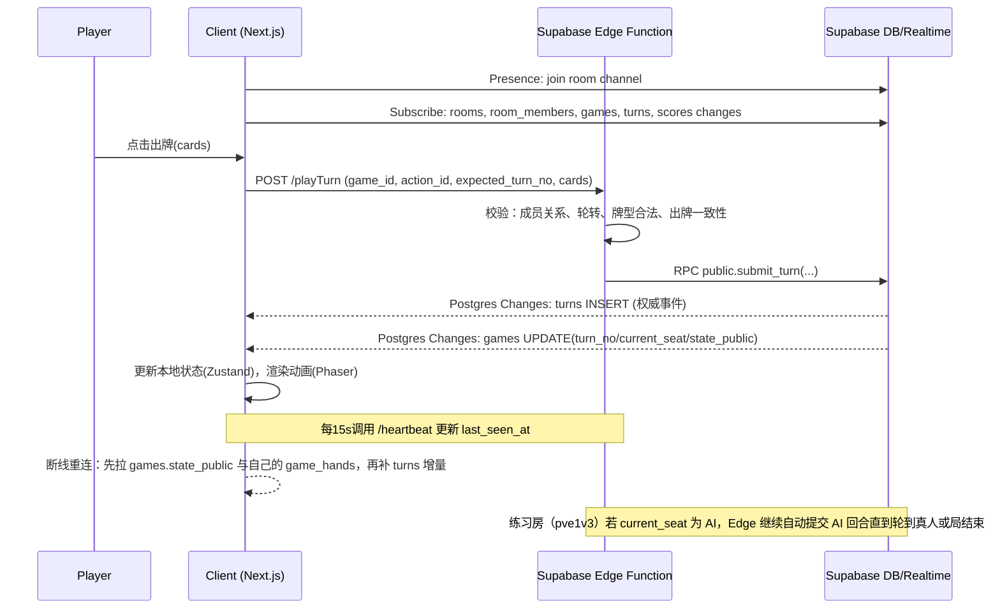

# 掼蛋3 技术方案（GuanDan3 Integrated Architecture）

**目标**  
- 并发 ≤ 20 人  
- 技术栈极简，前端优先  
- 游戏可在电脑与手机端运行（Web，响应式 + 触控优化）  
- 一键部署到 Fly.io 或 Render  
- 后端强制使用 Supabase（Auth、DB、Realtime、Storage、Edge Functions）

---

## 1. 业务场景与用例
- 进入即玩：首次打开即自动创建匿名会话（Supabase Anonymous Sign-in），无注册、无登录交互。
- 房型选择：用户进入后直接选择  
  - 练习房：3 个 AI + 1 人（1v3），自动建房并填充 AI 座位，点击开始即可开局  
  - 对战房：4 人真人，支持创建/加入房间、准备/取消准备、房主开局
- 牌局生命周期：发牌、轮到玩家出牌、校验合法、广播状态、轮转到下一位、局结束、积分结算。
- 断线重连：客户端心跳失效后自动标记离线；重连后拉取最新牌局快照与补发增量。
- 积分与排名：每局结算积分累积到房间内玩家会话，支持简单排行榜。

---

## 2. 极简领域模型

**实体与关系**  
- users（Supabase Auth）  
- profiles（扩展信息，1:1 users）  
- rooms（房间，1:N room_members，1:N games）  
- room_members（玩家加入房间的成员关系，N:1 rooms，N:1 profiles）  
- games（牌局实例，N:1 rooms，1:N turns，1:N scores，1:N game_hands）  
- game_hands（每玩家私有手牌，N:1 games，N:1 profiles）  
- turns（出牌事件/动作流水，N:1 games，N:1 room_members）  
- scores（积分记录，N:1 games，N:1 room_members）

**关键字段建议**  
- rooms：id、owner_uid、mode(pvp4/pve1v3)、status(open/playing/closed)、visibility(public/private)、created_at  
- room_members：id、room_id、member_type(human/ai)、uid(人类可空)、ai_key(AI可空)、seat_no(0-3)、ready(boolean)、last_seen_at  
- games：id、room_id、seed、status(deal/playing/finished)、turn_no、current_seat、state_public(jsonb)、created_at、updated_at  
- game_hands：game_id、uid、hand(jsonb)、updated_at  
- turns：id、game_id、turn_no、seat_no、action_id、payload(jsonb)、created_at  
- scores：id、game_id、uid、delta、total_after、created_at

---

## 3. 技术选型与理由
- 前端框架：Next.js 14（App Router）  
  - 目标首屏加载 ≤ 2s（3G）可通过 SSR/ISR、路由级代码分割、静态资源预压缩实现  
  - 与 Supabase 客户端集成成熟，边缘函数可选
- 状态管理：Zustand（切片化 + 选择器），避免不必要重渲染
- 认证方式：Supabase Anonymous Sign-in（无注册无登录交互）  
  - 目的：仍然获得稳定 uid，便于 RLS 隔离与断线重连恢复
- UI/渲染（分阶段）：先轻量跑通试用，再补足体验  
  - 试用版（MVP）：优先 DOM + CSS（或少量 Canvas），保证规则正确、同步稳定、可在手机上玩  
  - 增强版：引入 Phaser 3 做卡牌动画与拖拽交互，保持渲染与业务状态解耦
- 实时方案：Supabase Realtime  
  - Broadcast/Presence 用于在线状态与轻量事件  
  - Postgres Changes 用于权威状态变更（表级订阅）
- 部署方式：Docker 容器  
  - Fly.io 或 Render，单实例 1 vCPU，支持健康检查与自动重启  
  - GitHub Actions 触发构建与部署，一键发布

---

## 4. Supabase 表结构 SQL（含 RLS）

```sql
撤销匿名用户和已认证用户对public模式的所有权限；
授予匿名用户和已认证用户对public模式的使用权限;

create table if not exists public.profiles (
  uid uuid primary key references auth.users(id) on delete cascade,
  nickname text not null default '玩家',
  avatar_url text,
  created_at timestamptz not null default now()
);

alter table public.profiles enable row level security;
create policy "profiles_select_self" on public.profiles
  for select using (auth.uid() = uid);
create policy "profiles_insert_self" on public.profiles
  for insert with check (auth.uid() = uid);
create policy "profiles_update_self" on public.profiles
  for update using (auth.uid() = uid) with check (auth.uid() = uid);

create table if not exists public.rooms (
  id uuid primary key default gen_random_uuid(),
  owner_uid uuid not null references auth.users(id) on delete cascade,
  mode text not null default 'pvp4' check (mode in ('pvp4', 'pve1v3')),
  status text not null default 'open',
  visibility text not null default 'public',
  created_at timestamptz not null default now()
);

alter table public.rooms enable row level security;
create policy "rooms_select_by_member_or_public" on public.rooms
  for select using (
    visibility = 'public'
    or exists (
      select 1 from public.room_members m
      where m.room_id = rooms.id and m.uid = auth.uid()
    )
  );
create policy "rooms_insert_owner" on public.rooms
  for insert with check (auth.uid() = owner_uid);
create policy "rooms_update_owner" on public.rooms
  for update using (auth.uid() = owner_uid) with check (auth.uid() = owner_uid);

create table if not exists public.room_members (
  id uuid primary key default gen_random_uuid(),
  room_id uuid not null references public.rooms(id) on delete cascade,
  member_type text not null default 'human' check (member_type in ('human', 'ai')),
  uid uuid references auth.users(id) on delete cascade,
  ai_key text,
  seat_no int not null check (seat_no between 0 and 3),
  ready boolean not null default false,
  last_seen_at timestamptz not null default now(),
  unique(room_id, seat_no)
);

create unique index if not exists room_members_room_uid_uq
  on public.room_members(room_id, uid)
  where uid is not null;

create unique index if not exists room_members_room_ai_key_uq
  on public.room_members(room_id, ai_key)
  where ai_key is not null;

alter table public.room_members enable row level security;
create policy "members_select_self_room" on public.room_members
  for select using (
    exists (select 1 from public.room_members m
            where m.room_id = room_members.room_id and m.uid = auth.uid())
  );

create table if not exists public.games (
  id uuid primary key default gen_random_uuid(),
  room_id uuid not null references public.rooms(id) on delete cascade,
  seed bigint not null,
  status text not null default 'deal',
  turn_no int not null default 0,
  current_seat int not null default 0,
  state_public jsonb not null default '{}'::jsonb,
  state_private jsonb not null default '{}'::jsonb,
  created_at timestamptz not null default now(),
  updated_at timestamptz not null default now()
);

alter table public.games enable row level security;
create policy "games_select_by_member" on public.games
  for select using (
    exists (select 1 from public.room_members m
            where m.room_id = games.room_id and m.uid = auth.uid())
  );

create table if not exists public.game_hands (
  game_id uuid not null references public.games(id) on delete cascade,
  uid uuid not null references auth.users(id) on delete cascade,
  hand jsonb not null default '[]'::jsonb,
  updated_at timestamptz not null default now(),
  primary key (game_id, uid)
);

alter table public.game_hands enable row level security;
create policy "hands_select_self" on public.game_hands
  for select using (
    uid = auth.uid()
    and exists (
      select 1
      from public.games g
      join public.room_members m on m.room_id = g.room_id
      where g.id = game_hands.game_id and m.uid = auth.uid()
    )
  );

create table if not exists public.turns (
  id uuid primary key default gen_random_uuid(),
  game_id uuid not null references public.games(id) on delete cascade,
  turn_no int not null,
  seat_no int not null check (seat_no between 0 and 3),
  action_id uuid not null,
  payload jsonb not null,
  created_at timestamptz not null default now()
);

create unique index if not exists turns_game_turn_no_uq on public.turns(game_id, turn_no);
create unique index if not exists turns_game_action_id_uq on public.turns(game_id, action_id);

alter table public.turns enable row level security;
create policy "turns_select_by_member" on public.turns
  for select using (
    exists (
      select 1 from public.games g
      join public.room_members m on m.room_id = g.room_id
      where g.id = turns.game_id and m.uid = auth.uid()
    )
  );

create table if not exists public.scores (
  id uuid primary key default gen_random_uuid(),
  game_id uuid not null references public.games(id) on delete cascade,
  uid uuid not null references auth.users(id) on delete cascade,
  delta int not null,
  total_after int not null,
  created_at timestamptz not null default now()
);

alter table public.scores enable row level security;
create policy "scores_select_by_member" on public.scores
  for select using (
    exists (
      select 1 from public.games g
      join public.room_members m on m.room_id = g.room_id
      where g.id = scores.game_id and m.uid = auth.uid()
    )
  );

撤销匿名用户和已认证用户对表public.rooms的所有权限；
撤销匿名用户和已认证用户对表public.room_members的所有权限；
撤销匿名用户和已认证用户对表public.games的所有权限；
撤销匿名用户和已认证用户对表public.game_hands的所有权限；
撤销匿名用户和已认证用户对表public.turns的所有权限；
撤销匿名用户和已认证用户对表public.scores的所有权限;

授予 authenticated 对表 public.profiles 的 select、insert、update 权限；
授予 authenticated 对表 public.rooms 的 select 权限；
授予 authenticated 对表 public.room_members 的 select 权限；
授予 authenticated 对表 public.games 的 select 权限；
授予 authenticated 对表 public.game_hands 的 select 权限；
授予 authenticated 对表 public.turns 的 select 权限；
授予 authenticated 对表 public.scores 的 select 权限。
撤销 authenticated 对表 public.games 中 state_private 列的 select 权限；
撤销 anon 对表 public.games 中 state_private 列的 select 权限;

create or replace function public.create_practice_room(
  p_visibility text default 'private'
)
returns table(room_id uuid)
language plpgsql
security definer
set search_path = public, auth
as $$
declare
  v_room_id uuid;
begin
  insert into public.rooms(owner_uid, mode, visibility, status)
  values (auth.uid(), 'pve1v3', p_visibility, 'open')
  returning id into v_room_id;

  insert into public.room_members(room_id, member_type, uid, ai_key, seat_no, ready)
  values
    (v_room_id, 'human', auth.uid(), null, 0, true),
    (v_room_id, 'ai', null, 'bot_easy_1', 1, true),
    (v_room_id, 'ai', null, 'bot_easy_2', 2, true),
    (v_room_id, 'ai', null, 'bot_easy_3', 3, true);

  return query select v_room_id;
end;
$$;

grant execute on function public.create_practice_room(text) to authenticated;

create or replace function public.submit_turn(
  p_game_id uuid,
  p_action_id uuid,
  p_expected_turn_no int,
  p_payload jsonb
)
returns table(turn_no int, current_seat int)
language plpgsql
security definer
set search_path = public, auth
as $$
declare
  v_room_id uuid;
  v_current_seat int;
  v_turn_no int;
  v_my_seat int;
begin
  select g.room_id, g.current_seat, g.turn_no
    into v_room_id, v_current_seat, v_turn_no
  from public.games g
  where g.id = p_game_id
  for update;

  if v_turn_no <> p_expected_turn_no then
    raise exception 'turn_no_mismatch';
  end if;

  select m.seat_no into v_my_seat
  from public.room_members m
  where m.room_id = v_room_id and m.uid = auth.uid();

  if v_my_seat is null then
    raise exception 'not_a_member';
  end if;

  if v_my_seat <> v_current_seat then
    raise exception 'not_your_turn';
  end if;

  insert into public.turns(game_id, turn_no, seat_no, action_id, payload)
  values (p_game_id, v_turn_no, v_my_seat, p_action_id, p_payload);

  update public.games
    set turn_no = v_turn_no + 1,
        current_seat = (v_current_seat + 1) % 4,
        updated_at = now()
  where id = p_game_id;

  return query
    select v_turn_no, (v_current_seat + 1) % 4;
end;
$$;

grant execute on function public.submit_turn(uuid, uuid, int, jsonb) to authenticated;
```

---

## 5. 实时游戏状态同步流程



---

## 6. 快速部署脚本

**docker-compose.yml（本地与部署通用）**
```yaml
version: "3.9"
services:
  web:
    build: .
    ports:
      - "3000:3000"
    environment:
      - NEXT_PUBLIC_SUPABASE_URL=${NEXT_PUBLIC_SUPABASE_URL}
      - NEXT_PUBLIC_SUPABASE_ANON_KEY=${NEXT_PUBLIC_SUPABASE_ANON_KEY}
    command: "node server.js"
```

**.github/workflows/deploy-fly.yml**
```yaml
name: Deploy to Fly
on:
  push:
    branches: ["main"]
jobs:
  deploy:
    runs-on: ubuntu-latest
    steps:
      - uses: actions/checkout@v4
      - uses: superfly/flyctl-actions/setup-flyctl@v1
      - run: flyctl deploy --remote-only
        env:
          FLY_API_TOKEN: ${{ secrets.FLY_API_TOKEN }}
```

**fly.toml（示例）**
```toml
app = "guandan3"
primary_region = "sin"
[build]
  dockerfile = "Dockerfile"
[http_service]
  internal_port = 3000
  force_https = true
  auto_stop_machines = true
```

**render.yaml（可选）**
```yaml
services:
  - type: web
    name: guandan3
    env: docker
    plan: starter
    autoDeploy: true
    envVars:
      - key: NEXT_PUBLIC_SUPABASE_URL
        sync: false
      - key: NEXT_PUBLIC_SUPABASE_ANON_KEY
        sync: false
```

---

## 7. 测试策略
- 单元测试：牌型判断、出牌合法性、座位轮转；目标覆盖率 ≥ 85%
- 集成测试：房间创建/加入/准备/开始/结束完整路径；Next.js + Playwright
- 并发压测（20 人）：k6 场景  
  - 同步订阅 rooms/room_members/games/turns/scores  
  - 每秒 5 次出牌 RPC 峰值（submit_turn）  
  - 监控 P99 延迟与失败率
- 客户端性能：Lighthouse 3G 模式，FCP ≤ 2s，交互时间 ≤ 4s

**压测阈值（建议写进 k6 thresholds）**  
- submit_turn：P95 ≤ 60ms，P99 ≤ 100ms，错误率 < 0.1%  
- Realtime：turns INSERT 推送到客户端的 P99 ≤ 60ms（同区域部署前提）  
- 资源：web 容器 CPU 平均 ≤ 30%，内存无持续上升

---

## 8. 运维与监控
- 日志：前端 Sentry；Fly/Render 采集容器 stdout；Supabase 控制台审计日志
- 告警：Sentry Issue、容器重启次数、RPC 错误率、Realtime 断开率
- 备份：使用 Supabase 数据库每日快照与 PITR；对象存储版本化
- 回滚：上次成功镜像保留；Fly/Render 一键回滚到上个版本

---

## 9. 缺失内容补充
- 无感进入（无注册无登录）：客户端启动即执行 Supabase Anonymous Sign-in，生成用户会话与 uid，用于 RLS 与数据隔离
- 断线重连与恢复：重连后先拉取 games.state_public 与自己的 game_hands，再按 turns 增量回放到最新，避免依赖客户端缓存
- 作弊检测与一致性：私密信息（手牌）落 game_hands 且仅本人可读；写入只允许 Edge/RPC；turn_no + action_id 做顺序与幂等；数据库侧用行锁保证同一局不会并发写乱序
- 版本热更新：静态资源内容指纹，CDN 缓存 immutable；发布后通过版本号/构建号写入 HTML，触发客户端发现版本变更后强制刷新

---

## 10. 验收标准（可度量）
- 代码到线上 ≤ 15 分钟  
  - GitHub Actions 从 push 到 Fly/Render 完成部署 ≤ 15 分钟
- 首次加载 ≤ 2 秒（3G 网络）  
  - Lighthouse Mobile 模式 FCP ≤ 2s
- 单局延迟 ≤ 100 ms（P99）  
  - 指标口径：turns.created_at（DB 写入完成）→客户端收到 turns 变更事件的耗时 P99 ≤ 100ms（同区域部署前提）
  - 辅助口径：RPC public.submit_turn 服务端耗时 P99 ≤ 100ms
- 20 人同时在线 CPU ≤ 30%（1 vCPU）  
  - 指标口径：Fly/Render 上 web 容器平均 CPU 占用 ≤ 30%（不包含 Supabase 托管资源）
- 零人工干预 7×24h 无崩溃  
  - 连续 7 天容器无崩溃、Supabase 无严重错误，告警为 0 P0

---

## 11. 后端开发计划（Supabase 强约束）

**目标原则**  
- 客户端默认只读：除 profiles 外，业务表写入全部走 Edge Function + RPC  
- 状态权威在数据库：Realtime 只做广播与订阅，不做权威判定  
- 先可运行后完备：优先保证 20 并发稳定，再逐步加规则与风控

**里程碑与交付物**  
- M1（0.5–1 天）：数据模型与权限基线  
  - 交付：rooms/room_members/games/game_hands/turns/scores 建表、RLS、生效的 revoke/grant
- M2（1–2 天）：权威写入接口（Edge + RPC）  
  - 交付：/createPvpRoom、/joinRoom、/setReady、/startGame、/playTurn、/heartbeat  
  - 交付：/createPracticeRoom（pve1v3）：自动创建房间并写入 1 人 + 3 AI 的 room_members
  - 交付：submit_turn RPC 幂等与顺序控制（turn_no + action_id）
- M3（1–2 天）：断线重连与牌局恢复  
  - 交付：基于 turn_no 的增量拉取；客户端重连自动追平；离线超时踢出策略
- M4（1–2 天）：作弊检测与一致性校验（轻量版）  
  - 交付：频率限制（Edge 内存令牌桶或 Postgres 计数）；非法动作审计表；异常牌型/超速出牌告警
- M5（0.5–1 天）：可运维化  
  - 交付：关键指标面板（RPC 延迟、错误率、Realtime 断开率）、备份/回滚演练脚本

**后端验收指标（与全局指标对齐）**  
- submit_turn P99 ≤ 100ms（20 人并发压测）  
- turns 重复写入率 = 0（action_id 幂等）  
- 越权读取 = 0（game_hands 仅本人可读，审计抽样验证）  
- 断线重连成功率 ≥ 99%（20 次断线重连脚本回放）  

**练习房自动建房 + AI 补位（MVP 落地方式）**  
- 客户端入口选择“练习房 1v3 AI”后调用 RPC `public.create_practice_room()`，拿到 room_id 并跳转 /room/[roomId] 或直接 /game（看是否自动开局）  
- 房间内 4 个座位固定：seat_no=0 为真人（当前匿名 uid），seat_no=1/2/3 为 AI（ai_key 固定）  
- 所有写入由 RPC/Edge 完成，客户端仅订阅 rooms/room_members/games/turns/scores，确保不需要额外登录流程也不会越权  

**AI 自动出牌触发机制（建议，避免引入常驻 Worker）**  
- 触发点：每次真人成功出牌后，由同一个 Edge Function 在一次请求内串行补齐 AI 回合  
- 策略：当 submit_turn 更新 games.current_seat 后，若下一位是 AI，则 Edge 读取 games.state_private，计算 AI 动作，再继续调用 submit_turn；最多连续执行 3 次（直到轮到真人或局结束）  
- 约束：单次请求内的 AI 回合数上限 + payload 大小上限，防止极端情况导致 Edge 超时  
- 失败回退：若 AI 计算失败或超时，写入 turns.payload 中的 error 标记并将控制权交回真人（或直接判定 AI “不要”），保证对局不中断

**修改风险：AI 逻辑耦合（建议纳入 Phase 2/3）**  
- 风险点：AI 出牌逻辑放在 Edge Function 内会拉长真人操作的请求耗时，造成 P99 抖动  
- 解耦方向（可选）  
  - 独立 AI 微服务：将 AI 决策作为独立服务部署（Fly/Render 单独服务），Edge 仅编排与落库  
  - 异步处理：真人请求只负责落库与推进到 AI 回合；AI 决策通过任务队列异步执行并提交 turns，避免阻塞真人操作  
  - AI 决策缓存：对同一局同一状态的决策结果做短期缓存（key=game_id+turn_no+state_hash），减少重复计算与抖动  

---

## 12. UI 开发计划（先轻量跑通试用，再分阶段满足要求）

**核心原则**  
- 先可用后好用：先把进入即玩、房型选择、建房/开局、出牌、结算跑通并可试用，再做动效与视觉增强  
- 低复杂度优先：MVP 以 DOM + CSS 为主，避免早期引入 Phaser 导致交互与性能调优成本上升  
- 保持可替换：业务状态（Zustand + Supabase）与渲染层（DOM/Canvas/Phaser）解耦，后续替换不改后端协议

**信息架构（最小页面集）**  
- /：进入即玩 + 房型选择（练习房 1v3 AI / 4 人对战）  
- /lobby：对战房列表、创建房间、加入房间  
- /room/[roomId]：座位/准备状态、房主开局、邀请链接（私密房）  
- /game/[gameId]：手牌区、当前轮到提示、出牌/不要按钮、回合记录、结算弹窗

**阶段实施与交付物**
- U1（试用版，1–2 天）：可完成一局的轻量 UI  
  - 交付：入口页（房型选择：练习房 1v3 AI / 4 人对战）  
  - 交付：基础布局（大厅/房间/牌桌），手牌用可点击列表/栅格展示，出牌用选择 + 确认  
  - 交付：弱动效（CSS transition），不做拖拽、不引入 Phaser  
  - 交付：错误与加载态（断线提示、重连中、出牌失败 toast）  
  - 试用验收：4 人能连续完成 3 局无阻断；新用户 2 分钟内能进房开局
- U2（可玩版，2–4 天）：交互与移动端体验达标  
  - 交付：响应式布局（360/768/1024 三档），竖屏优先；触控区域 ≥ 44×44  
  - 交付：出牌交互优化（多选、快速取消、上一手高亮、轮到我强提示）  
  - 交付：断线重连体验（顶部状态条 + 一键重连 + 自动追平 turn_no）  
  - 试用验收：移动端单手操作完成出牌；断线 10 次可自动恢复 ≥ 99%
- U3（增强版，按需）：视觉与动效增强但不牺牲性能  
  - 交付：引入 Phaser 3 做卡牌动画/拖拽/发牌/收牌（仅渲染层替换）  
  - 交付：资源优化（对象池、纹理图集、懒加载），保持首屏与交互性能预算不退化  
  - 试用验收：60 FPS 目标，关键交互无卡顿，弱网下仍可稳定完成对局

**UI 规范（轻量设计系统，先够用再扩展）**  
- 颜色 Token（建议）  
  - 背景：#0B1220，卡片：#111B2E，描边：#22314D  
  - 主色：#4F46E5，成功：#16A34A，危险：#DC2626，警告：#F59E0B  
  - 文字：#E5E7EB，次要文字：#9CA3AF，焦点环：#93C5FD
- 字体与排版  
  - 字体：系统字体栈；正文 14–16px；数字/牌面可用等宽字体作为可选增强  
  - 行高：1.4–1.6；信息层级用 12/14/16/20 的阶梯
- 间距与栅格  
  - 4px 递进（4/8/12/16/24/32）；容器左右内边距移动端 16px  
  - 牌桌核心区优先保持稳定布局，避免频繁重排导致误触

**无障碍与可用性要求（从 U1 就满足）**  
- 所有按钮可键盘操作，焦点可见；对话框/抽屉需 focus trap 与 Esc 关闭  
- 状态变化（轮到我、出牌失败、重连成功）需可读提示（aria-live 区域或可见提示条）  
- 颜色对比度满足 WCAG AA（正文 ≥ 4.5:1）
- 组件状态齐全：default/hover/focus/active/disabled/loading/empty/error
- 输入与触控：点击热区 ≥ 44×44；避免仅靠颜色区分状态（增加图标/文本）

**UI 性能预算（与 3G/2s 目标对齐）**  
- 首屏关键资源：优先减少 JS 与大图；首屏动画以 CSS 为主  
- 路由级拆分：/game 路由晚加载重资源（Phaser 仅在 U3 启用）  
- CDN 缓存：静态资源指纹 + immutable；HTML 携带构建号用于触发版本刷新

---

## 13. 性能方案与优化建议（面向 20 并发、极简可落地）

**性能预算（建议作为后续调优的对照基线）**  
- 互动链路：玩家点击出牌 → Edge Function 校验 → DB 提交 turns → Realtime 推送 → 其他客户端渲染  
- P99 预算拆分（同区域部署前提）  
  - Edge Function 处理：≤ 20ms  
  - DB 写入（含行锁与索引）：≤ 30ms  
  - Realtime 推送：≤ 40ms  
  - 客户端渲染与状态合并：≤ 10ms  

**部署与网络（决定 100ms 能否达标）**  
- web（Fly/Render）与 Supabase 项目必须选择同一地理区域，否则 P99 延迟目标大概率无法稳定满足  
- 线上压测必须从接近部署区域的 runner 发起，避免把公网跨境 RTT 计入系统指标

**Realtime 与状态设计（减消息、控大小、降抖动）**  
- 订阅粒度：按 room_id/game_id 分频道或按查询过滤，避免大厅订阅全量 turns  
- 消息体控制  
  - turns.payload 控制在 1KB 级别（只传行动必要字段）  
  - games.state_public 控制在 8KB 级别（只放公开信息与少量派生状态）  
- 广播策略  
  - 权威事件只依赖 Postgres Changes（turns/games）  
  - Presence 只用于在线状态展示，心跳频率建议 15–30s，避免高频写 last_seen_at

**数据库侧（稳定优先，避免 P99 尖刺）**  
- 关键查询索引建议  
  - room_members(room_id, uid) 用于成员校验与 seat 查询  
  - games(room_id) 用于房间查当前局  
  - scores(game_id, created_at) 用于结算与历史展示  
- 表增长控制  
  - turns 按 game_id 查询为主，建议只保留近 N 天对局详情，其余做归档或只保留汇总（scores）  
- 事务控制  
  - submit_turn 内保持最小事务：只做必要校验与写入，避免把复杂牌型计算放进数据库事务导致锁持有时间增长

**应用侧（web 容器 CPU ≤ 30% 的关键）**  
- /game 路由避免 SSR 的重渲染成本：尽量客户端渲染 + 轻量骨架屏，减少 Node 端渲染压力  
- 静态优先：/、/lobby 走静态或 ISR，减少请求计算  
- 依赖收敛：避免在 Edge/Web 侧引入大体积库（尤其是 Phaser 在 U1/U2 不进入首屏）

**压测方法（让指标可复现）**  
- k6 以“房间=1，玩家=4，观战/旁路=16”的混合模型模拟真实负载  
- 同时压测三类指标  
  - RPC：submit_turn 的 P95/P99 与错误率  
  - 推送：turns.created_at 到客户端收到事件的分位数（客户端上报或压测脚本接收时间戳）  
  - 资源：web 容器 CPU/内存、Realtime 断开率、错误码分布  

---

## 14. 性能修改计划（按阶段实施，先跑通再达标）

**阶段 P0（0.5 天）：建立可复现的性能基线**  
- 目标：让“≤100ms(P99)”与“CPU≤30%”可被持续验证  
- 修改项  
  - 固化指标口径：以 turns.created_at → 客户端收到 turns 事件为端到端延迟  
  - 固化阈值：把 submit_turn/错误率/资源阈值写入压测阈值（k6 thresholds）  
- 验收：在本地或预发环境跑通基线压测报告（含 P95/P99、错误率、CPU/内存）

**阶段 P1（0.5 天）：部署与网络对齐（最小成本提升 P99）**  
- 目标：消除跨区域 RTT 导致的 P99 尖刺  
- 修改项  
  - web 部署区域与 Supabase 项目区域对齐  
  - 压测 runner 选择同区域或就近区域  
- 验收：同负载下端到端 P99 明显下降且波动收敛（对比 P0 报告）

**阶段 P2（1 天）：Realtime 减载（降低推送延迟与断连率）**  
- 目标：在 20 并发下推送稳定、消息体可控  
- 修改项  
  - 订阅收敛：大厅不订阅 turns，全量订阅改为按 room_id/game_id 过滤  
  - 消息瘦身：turns.payload ≤ 1KB，games.state_public ≤ 8KB  
  - 心跳降频：Presence/heartbeat 调整到 15–30s，避免高频写 last_seen_at  
- 验收：Realtime 推送 P99 ≤ 60ms（同区域前提），断连率显著下降

**阶段 P3（1 天）：数据库稳定性（控制锁与索引，降低 P99 尖刺）**  
- 目标：submit_turn 事务稳定、避免锁持有时间增长  
- 修改项  
  - 补齐关键索引：room_members(room_id, uid)、games(room_id)、scores(game_id, created_at)  
  - 事务最小化：复杂牌型计算移出数据库事务（Edge 侧完成校验后提交）  
  - 历史归档策略：turns 只保留近 N 天详情，其余保留汇总（scores）  
- 验收：submit_turn P99 ≤ 100ms 且长时间压测下无明显尾延迟恶化

**阶段 P4（1–2 天）：前端性能预算落地（保证 3G/2s 与渲染稳定）**  
- 目标：首屏与交互性能不被后续功能侵蚀  
- 修改项  
  - /、/lobby 静态优先（静态或 ISR），/game 轻量 CSR + 骨架屏  
  - 资源分包：Phaser（若启用）仅在 U3 动态加载，不进入首屏包  
  - 渲染降噪：Zustand 选择器收敛重渲染，避免每个推送导致全树更新  
- 验收：Lighthouse 3G FCP ≤ 2s；对局中关键交互无明显掉帧

---

## 15. 指标采集与压测执行（可落地做法）

**端到端延迟采集（建议）**  
- turns 表中以 created_at 作为“DB 写入完成时间戳”  
- 客户端收到 turns 变更事件时记录本地时间 t_client_recv  
- 延迟 = t_client_recv - turns.created_at  
- 上报方式（任选其一）  
  - 客户端将延迟采样写入日志/监控（例如 Sentry breadcrumb 或自建简单 metrics 表）  
  - 压测脚本使用 Realtime 订阅 turns，并在收到事件时计算分位数

**压测场景分层（建议）**  
- 场景 A（写入链路）：持续调用 submit_turn，验证 P95/P99 与错误率  
- 场景 B（推送链路）：保持订阅与心跳，验证推送延迟 P99 与断连率  
- 场景 C（混合真实负载）：4 名活跃玩家 + 16 旁路订阅，持续 10–30 分钟观察尾延迟与内存趋势

**结果判定（建议）**  
- 每次改动必须提供对比：改动前/后压测报告（P95/P99、错误率、CPU/内存、断连率）  
- 若 P99 变差：优先回退 Realtime 订阅范围与 payload 大小，再检查数据库锁与索引  

---

## 实施可行性评审与修改建议（结论：可实施，但需收敛与补齐落地细节）

**总体结论**  
- 在“≤20 并发、4 人一桌、功能聚焦”为前提下，本方案可以实施并达成目标  
- 关键在于：先交付 MVP（U1 + 后端 M1/M2 + P0 基线），再逐步增强 UI（U2/U3）与性能（P1–P4）

**分阶段实施计划（按你的要求）**  
- Phase 1：MVP 基础版  
  - 核心功能：匿名进入、房间管理、基础出牌逻辑（含练习房 1v3 AI 的自动建房与补位）  
  - 简化 UI：DOM + CSS，暂不引入 Phaser  
  - 基础测试：单元测试覆盖核心逻辑
- Phase 2：稳定版  
  - 性能优化：建立性能基线并优化关键路径  
  - 用户体验：断线重连、错误处理  
  - 监控部署：性能监控和告警
- Phase 3：增强版  
  - 视觉升级：引入 Phaser，增强动画效果  
  - 功能完善：排行榜、历史记录  
  - 压力测试：验证 20 并发性能目标  
  - AI 解耦：将 AI 决策异步化或独立微服务，降低对真人请求的影响

**必须补齐的落地项（否则一键部署与验收会卡住）**  
- Supabase 变更发布：需要明确“数据库迁移/函数/权限”如何随代码一键发布（推荐：Supabase CLI migrations + GitHub Actions 自动 apply）  
- Edge Functions 部署：需要明确 Edge Functions 的发布流程与密钥管理（SERVICE_ROLE 只在服务器/CI，绝不进客户端）  
- 容器启动命令：文档里的 `command: "node server.js"` 需要与实际 Next.js 产物一致（建议改为 `npm run start` 或 Next standalone 输出，避免部署时找不到 server.js）

**范围收敛建议（保证 1–2 周内能跑通试用）**  
- MVP（必须有）：进入即玩（匿名会话）、房型选择、练习房 1v3 AI、对战房建房/进房、4 人就坐与准备、开局、出牌/不要、结算、断线重连（自动追平 turn_no）  
- 延后（非 MVP）：Phaser 动效、复杂排行榜、AI 强化（高级策略/LLM）、长周期历史对局回放与深度反作弊

**后端可实施性风险与建议**  
- 房间容量与座位分配：必须由 Edge/RPC 权威控制（避免客户端并发加入导致 seat 冲突），并在后端计划里明确约束与失败返回  
- 状态一致性：当前 submit_turn 已有 turn_no + action_id + 行锁，建议再补充“非法 payload 的结构校验与长度限制”，避免 turns.payload 过大拖慢推送  
- Realtime 连接稳定性：Presence/heartbeat 频率建议 15–30s；大厅避免订阅 turns；按 room_id/game_id 过滤订阅

**验收建议（避免指标“写了但测不出来”）**  
- 每次迭代必须产出：P0 基线报告、改动前后对比压测报告、Lighthouse 报告截图/导出  
- 指标必须区分：端到端延迟（DB→客户端）与 RPC 延迟（服务端），并标注同区域前提


## 16. 代码审核标准与流程（测试优先原则）

### 16.1 核心原则：测试优先

**强制性要求**
1. **没有测试，不能提交代码**
   - 所有新增功能必须编写测试代码
   - 修复 bug 必须编写回归测试
   - 代码审核时测试代码与业务代码同等重要

2. **测试覆盖率是代码审核的硬性指标**
   - 单元测试覆盖率 ≥ 85%（核心业务逻辑）
   - 集成测试覆盖率 ≥ 70%
   - E2E 测试覆盖所有核心用户路径
   - 覆盖率不达标，直接拒绝合并

3. **审核代码与审核测试同等重要**
   - 测试代码的可读性、可维护性纳入审核范围
   - 测试用例的覆盖完整性纳入审核范围
   - 测试数据管理的规范性纳入审核范围

---

### 16.2 代码审核标准（七大维度 + 测试维度）

#### 16.2.1 正确性 (Correctness)

**标准要求**
- [ ] **业务逻辑正确**
  - 牌型判断准确（炸弹、顺子、同花顺等）
  - 出牌合法性校验完整（必须比上家大、不能出无效牌型等）
  - 轮转逻辑正确（turn_no 递增、current_seat 轮转）
  - 结算算法准确（积分计算、连分规则）

- [ ] **并发安全性**
  - submit_turn 幂等性保证（action_id 唯一约束）
  - turn_no 顺序校验防止并发写入
  - 行锁使用正确（SELECT ... FOR UPDATE）
  - 无竞态条件（race condition）或数据损坏

- [ ] **边界条件处理**
  - 空房间、单人房、满员房的创建/退出逻辑
  - 最后一个玩家退出时房间的清理
  - 多局连续进行的边界情况
  - 玩家中途离线时的恢复策略

**审核检查点**
- 单元测试覆盖所有分支条件（if/else/switch/for/while）
- 集成测试覆盖核心路径（创建→准备→开局→出牌→结算）
- 压测中无并发导致的数据不一致

---

#### 16.2.2 可维护性 (Maintainability)

**标准要求**
- [ ] **代码组织清晰**
  - 文件职责单一（每个文件/模块只负责一个功能）
  - 函数/方法长度 ≤ 50 行
  - 嵌套层级 ≤ 3 层
  - 避免上帝函数（single responsibility principle）

- [ ] **测试代码组织**
  - 测试文件与源文件命名一致（如 `card-hand.test.ts` 对应 `card-hand.ts`）
  - 测试按功能模块分组（同目录下按顺序执行）
  - 测试辅助函数/常量与源文件分离

- [ ] **命名规范**
  - 变量/函数命名符合语义（如 `isValidCardMove` 而非 `c1`）
  - 常量命名全大写（如 `MAX_PLAYERS`）
  - 布尔值命名使用 is/has/can/should 前缀（如 `isGameOver`）

- [ ] **依赖管理**
  - 明确依赖关系（Supabase SDK、Zustand、Phaser 等）
  - 避免循环依赖
  - 外部库版本锁定（package-lock.json/pnpm-lock.yaml）

- [ ] **设计模式应用**
  - 状态管理使用 Zustand slice 模式
  - UI 组件职责分离（容器组件 vs 展示组件）
  - 错误处理统一封装

**审核检查点**
- 代码审查通过后无违反 SOLID 原则的重大问题
- 无重复代码（DRY 原则）
- 测试代码无重复（测试辅助函数可复用）
- 无过长的函数/模块（> 300 行）

---

#### 16.2.3 可读性 (Readability)

**标准要求**
- [ ] **代码注释**
  - 复杂算法有注释说明（如牌型组合逻辑）
  - RLS 策略有说明注释（为什么这样设计权限）
  - API 端点有 Swagger/OpenAPI 注释
  - 不注释显而易见的代码（如 `x = x + 1`）

- [ ] **测试代码注释**
  - 复杂测试用例有注释说明测试意图
  - 边界条件测试用例有注释说明场景
  - Mock 数据有注释说明来源和用途

- [ ] **代码风格**
  - 使用 ESLint/Prettier 统一代码格式
  - 括号对齐、缩进一致
  - 导入顺序规范（react、utils、types、third-party）
  - 魔法数字使用常量定义

- [ ] **日志规范**
  - 关键操作有日志（createRoom、startGame、playTurn）
  - 错误日志包含上下文信息（game_id、user_id、action）
  - 敏感信息脱敏（不记录密码、token 等）
  - 日志级别合理（DEBUG/INFO/WARN/ERROR）

**审核检查点**
- 代码审查时无需要反复理解的地方
- 新成员能无障碍阅读代码和测试代码
- 测试用例的意图清晰，不依赖注释也能理解

---

#### 16.2.4 效率 (Efficiency)

**标准要求**
- [ ] **性能瓶颈**
  - submit_turn RPC 响应时间 P95 ≤ 60ms，P99 ≤ 100ms
  - Realtime 推送延迟 P99 ≤ 60ms（同区域部署）
  - Web 容器 CPU 平均 ≤ 30%（20 并发）
  - 首屏加载 FCP ≤ 2s（3G 网络）

- [ ] **资源优化**
  - 避免全表扫描（索引使用正确）
  - N+1 查询优化（JOIN 代替循环查询）
  - 无内存泄漏（EventSource/Subscription 正确关闭）
  - Phaser 对象池使用（减少 GC 压力）

- [ ] **缓存策略**
  - Supabase 数据使用 RLS + 缓存层（如边缘缓存）
  - 静态资源使用 CDN + 永久缓存（Cache-Control: immutable）
  - 游戏状态变更时选择性更新（delta 而非全量）

- [ ] **测试性能**
  - 单元测试执行时间 < 30 秒
  - 集成测试执行时间 < 2 分钟
  - E2E 测试执行时间 < 5 分钟
  - CI 流水线中测试不成为瓶颈

**审核检查点**
- 性能测试通过（k6 压测报告）
- Lighthouse 评分 ≥ 90（Performance）
- 压测 30 分钟无内存泄漏
- 测试执行时间在可接受范围内

---

#### 16.2.5 安全性 (Security)

**标准要求**
- [ ] **SQL 注入防护**
  - 所有数据库操作使用 Supabase RPC 或 Prepared Statements
  - 禁止字符串拼接 SQL（动态 SQL 必须经过参数化）
  - RLS 策略严格限制数据访问权限

- [ ] **XSS/CSRF 防护**
  - React 自动转义 HTML，避免 dangerouslySetInnerHTML
  - 表单输入进行校验和清理
  - 使用 Supabase Auth 处理认证（无自定义 Session 管理）

- [ ] **权限控制**
  - 越权访问检测（game_hands 只能读取自己）
  - 房间操作检查所有权（房主才能开始游戏）
  - 批量操作限制（防止攻击者滥用 API）

- [ ] **认证与授权**
  - 匿名会话正确实现（进入即玩，无登录交互）
  - Session Token 存储安全（避免泄露到日志与第三方）
  - Session 过期与刷新处理（自动续期或重新匿名登录）

- [ ] **Rate Limiting**
  - Edge Function 实现频率限制（令牌桶算法）
  - 防止暴力破解（重试次数限制）
  - 异常行为检测（短时间内大量操作）

**审核检查点**
- 安全扫描工具通过（npm audit、Snyk 等）
- 无高危漏洞（OWASP Top 10）
- 权限测试通过（越权访问、SQL 注入尝试）

**测试要求**
- [ ] 单元测试覆盖所有安全相关函数
- [ ] 集成测试测试权限校验逻辑
- [ ] 安全扫描自动化集成到 CI

---

#### 16.2.6 边缘情况与错误处理 (Edge Cases & Error Handling)

**标准要求**
- [ ] **错误处理**
  - 所有 API 端点有错误响应格式
  - 错误码清晰（turn_no_mismatch、not_a_member、not_your_turn）
  - 错误日志记录完整
  - 客户端有友好的错误提示

- [ ] **网络异常**
  - 断线重连逻辑完整（心跳失效检测）
  - Realtime 断开重连策略
  - 网络恢复后状态同步

- [ ] **数据异常**
  - 数据库连接失败的处理
  - 超时处理（fetch/setTimeout）
  - 数据不一致时的恢复策略

- [ ] **客户端异常**
  - 无 JavaScript 错误
  - Loading/Error/Empty 状态完整
  - 无白屏/死机现象

**审核检查点**
- 边缘情况测试用例通过
- 错误恢复测试通过（断线 20 次自动恢复 ≥ 99%）
- 崩溃率 < 0.01%

**测试要求**
- [ ] 单元测试覆盖所有错误分支
- [ ] 集成测试覆盖错误恢复流程
- [ ] E2E 测试覆盖网络异常场景

---

#### 16.2.7 可测试性 (Testability)

**标准要求**
- [ ] **单元测试**
  - 关键函数有单元测试（牌型判断、出牌校验、轮转逻辑）
  - 测试覆盖率 ≥ 85%（核心业务逻辑）
  - 使用测试替身（mock Supabase、网络）
  - 每个函数至少有 3 个测试用例（正常、边界、异常）

- [ ] **集成测试**
  - API 端点集成测试
  - 数据库操作测试
  - Realtime 订阅/发布测试
  - 跨模块集成测试

- [ ] **E2E 测试**
  - Playwright 测试核心路径（进入→选择房型→创建/加入房→出牌→结算）
  - 移动端适配测试
  - 断线重连测试
  - 多设备同步测试

- [ ] **测试数据管理**
  - 测试数据库隔离（不污染生产数据）
  - 测试数据可重复使用（fixture）
  - 清理机制（测试后清理）
  - 测试数据版本控制

**审核检查点**
- CI 流水线自动运行所有测试
- 新功能上线前测试通过率 100%
- 回归测试时间 < 5 分钟
- 测试可独立运行，不依赖外部服务

---

### 16.3 代码审核流程

#### 16.3.1 本地代码审核（自审）

**开发者自审清单（必须全部完成）**
1. [ ] **运行测试**
   - `npm run test:unit` 通过
   - `npm run test:integration` 通过
   - `npm run test:e2e` 通过（核心路径）
2. [ ] **检查覆盖率**
   - `npm run test:coverage` 显示覆盖率 ≥ 85%
   - 查看覆盖率报告，确认无低覆盖率区域
3. [ ] **运行 Lint**
   - `npm run lint` 通过（无错误）
   - `npm run type-check` 通过（无类型错误）
4. [ ] **检查 git diff**
   - 确保 `git diff` 只包含相关代码
   - 删除不必要的文件或注释
5. [ ] **填写 Commit Message**
   - 遵循 Conventional Commits 规范
   - 如有必要，添加 `[feature]`、`[fix]`、`[test]` 前缀
6. [ ] **更新文档**
   - 更新 API 文档
   - 更新架构文档
   - 添加必要的测试文档

#### 16.3.2 代码合并审核（互审）

**审核流程**
1. **创建 Pull Request**
   - 标题遵循规范：`feat: 添加出牌校验功能` 或 `fix: 修复断线重连问题`
   - 添加审核人员（至少 1 人）
   - 描述修改内容、解决的问题、测试情况
   - **关键**：附带测试覆盖率报告

2. **自动检查通过**
   - CI 流水线自动运行（Lint、Test、Type Check、Coverage）
   - 测试覆盖率必须 ≥ 85%
   - 安全扫描通过（npm audit、Snyk）
   - 性能检查通过（基准测试对比）

3. **人工审核（Code Review）**
   - **优先级 1**：审核测试代码
     - 测试用例是否覆盖所有分支？
     - 测试数据是否合理？
     - 测试辅助函数是否可复用？
     - 测试执行时间是否可接受？
   - **优先级 2**：审核业务代码
     - 代码结构是否清晰？
     - 命名是否语义化？
     - 错误处理是否完整？
   - **优先级 3**：审核安全性
     - 无安全漏洞？
     - 权限控制正确？
   - 使用评论标注问题和建议
   - 提供修改意见（"如何改进"而非"必须改"）

4. **修改与回复**
   - 开发者根据反馈修改代码
   - **修改后必须重新运行测试**（测试必须全部通过）
   - 使用 "Fixes #123" 关联 Issue
   - 审核者确认修改后 Approve

5. **合并代码**
   - Approve ≥ 1 人后可合并
   - 合并后自动部署到预发环境
   - 预发环境必须运行测试，无失败用例

#### 16.3.3 审核要点快速参考

**高优先级（Critical）**
- 安全漏洞（SQL 注入、XSS、权限越权）
- 并发安全问题（数据损坏、竞态条件）
- 逻辑错误（核心业务逻辑错误）
- 破坏性变更（API 变更、数据结构变更）
- **测试覆盖率低于 85%**
- **核心逻辑无测试覆盖**

**中优先级（Important）**
- 性能问题（延迟过高、资源浪费）
- 代码质量问题（可维护性、可读性）
- 错误处理不足（异常情况未处理）
- 测试覆盖不足（部分功能无测试）
- 测试用例不够全面（缺少边界条件测试）

**低优先级（Nice to have）**
- 代码风格不一致
- 注释不够清晰
- 命名不够语义化
- 重构机会

---

### 16.4 自动化审核工具

#### 16.4.1 代码质量检查

```yaml
# .github/workflows/code-quality.yml
name: Code Quality

on: [push, pull_request]

jobs:
  lint:
    runs-on: ubuntu-latest
    steps:
      - uses: actions/checkout@v4
      - run: npm ci
      - run: npm run lint -- --fix
      - run: npm run type-check

  test:
    runs-on: ubuntu-latest
    steps:
      - uses: actions/checkout@v4
      - run: npm ci
      - run: npm run test:ci

  coverage:
    runs-on: ubuntu-latest
    steps:
      - uses: actions/checkout@v4
      - run: npm ci
      - run: npm run test:coverage
      - uses: codecov/codecov-action@v3
        with:
          files: ./coverage/lcov.info
          flags: unittests
          name: codecov-umbrella
```

#### 16.4.2 SonarQube 集成（可选）

```yaml
# sonar-project.properties
sonar.projectKey=guandan3
sonar.sources=src
sonar.tests=test
sonar.test.inclusions=**/*.test.ts,**/*.test.tsx
sonar.javascript.lcov.reportPaths=coverage/lcov.info
```

---

### 16.5 测试代码审核清单

#### 16.5.1 单元测试审核

- [ ] **测试覆盖**
  - 每个函数都有对应的测试
  - 分支条件覆盖（if/else、switch、for/while）
  - 边界条件覆盖（最大值、最小值、空值）
  - 异常分支覆盖

- [ ] **测试质量**
  - 测试用例名称清晰描述测试场景
  - 使用 AAA 模式（Arrange、Act、Assert）
  - 断言清晰具体，不使用过于宽松的断言
  - 测试数据独立，不互相影响

- [ ] **测试组织**
  - 测试按功能模块分组
  - 测试辅助函数放在单独文件
  - 测试 fixture 数据可复用
  - 测试可独立运行

#### 16.5.2 集成测试审核

- [ ] **集成范围**
  - API 端点覆盖完整
  - 数据库操作覆盖完整
  - 跨模块集成覆盖

- [ ] **测试数据**
  - 测试数据隔离（不污染生产数据）
  - 测试数据可重复使用
  - 测试数据清理机制

- [ ] **Mock 策略**
  - Mock 不合理（过度 mock 或 mock 不够）
  - Mock 数据与真实数据一致
  - Mock 不影响测试的真实性

#### 16.5.3 E2E 测试审核

- [ ] **核心路径覆盖**
  - 进入→选择房型→练习房 1v3 AI / 对战房 4 真人→准备→开局→出牌→结算
  - 断线重连流程
  - 多设备同步流程

- [ ] **测试稳定性**
  - 测试不依赖网络延迟
  - 测试不依赖第三方服务
  - 测试可重复运行且结果一致

- [ ] **测试性能**
  - 测试执行时间 < 5 分钟
  - 测试不阻塞 CI 流水线

---

### 16.6 审核记录模板

**Pull Request 审核记录**

| 字段 | 内容 |
|---|---|
| PR 编号 | #123 |
| 审核人 | @zhangsan |
| 审核时间 | 2024-XX-XX |
| 审核结果 | ✅ Approved / 🔄 Changes Requested / ⚠️ Pending |
| 审核摘要 | 审核通过，仅有 minor 建议 |
| Critical 问题 | 无 |
| Important 问题 | 1. 错误处理缺少超时逻辑 |
| Nice to have 问题 | 1. 添加部分单元测试 |
| 测试覆盖 | 单元测试: 87% | 集成测试: 72% |
| 测试代码审核 | 测试用例覆盖全面，测试辅助函数可复用，测试执行时间 < 30s |
| 修改建议 | 1. 在 submit_turn 中添加 try-catch 超时处理 |

---

## 18. 前端代码审核标准

### 18.1 核心原则

**强制性要求**
1. **没有测试的代码不能提交**
   - 所有新增组件必须编写单元测试
   - 核心业务组件必须编写集成测试
   - E2E 测试覆盖所有核心用户路径
   - 测试覆盖率 ≥ 85%（组件层级）

2. **React 最佳实践**
   - 遵循 React 官方指南和模式
   - 使用函数组件和 Hooks（避免 Class 组件）
   - 保持组件的单一职责
   - 使用 TypeScript 严格模式

3. **代码质量优先**
   - 遵循代码风格规范（ESLint + Prettier）
   - 代码审查通过后才能合并
   - 无安全漏洞、无性能问题
   - 无严重 bug

---

### 18.2 前端代码审核标准（五大维度）

#### 18.2.1 React 组件设计

**标准要求**
- [ ] **组件拆分原则**
  - 单个组件文件 ≤ 300 行
  - 一个文件只导出一个组件
  - 相关组件放在同一个目录
  - 组件名称与文件名一致（PascalCase）

- [ ] **组件职责**
  - UI 组件与业务逻辑组件分离
  - 容器组件（Container）负责状态管理
  - 展示组件（Presentational）只负责渲染
  - 避免上帝组件（God Component）

- [ ] **Props 接口**
  - 定义清晰的 Props 接口（TypeScript interface）
  - 使用 `?:` 可选参数
  - 必填参数使用 `required` 标记
  - Props 类型必须完整

**审核检查点**
- 组件拆分合理，职责单一
- Props 接口完整，无隐式 any
- Props 变化能触发重渲染优化

**测试要求**
- [ ] 组件测试覆盖所有 Props 变化
- [ ] 渲染结果符合预期
- [ ] 边界情况测试

---

#### 18.2.2 React Hooks 使用规范

**标准要求**
- [ ] **Hooks 使用**
  - 只在 React 函数组件和自定义 Hooks 中调用 Hooks
  - 只在函数组件顶层调用 Hooks
  - 不在条件语句、循环中调用 Hooks
  - 使用 ESLint 规则 `react-hooks/rules-of-hooks` 检测

- [ ] **自定义 Hooks**
  - 自定义 Hook 命名以 `use` 开头
  - 自定义 Hook 负责复用有状态的逻辑
  - 使用自定义 Hook 提取复杂组件逻辑
  - 自定义 Hook 可以调用其他 Hooks

- [ ] **性能优化 Hooks**
  - 使用 `React.memo` 包装纯展示组件
  - 使用 `useCallback` 缓存函数引用
  - 使用 `useMemo` 缓存计算结果
  - 合理使用避免过度优化

**审核检查点**
- Hooks 使用符合规则
- 无 hook 循环依赖
- 性能优化适当，无过度优化

**测试要求**
- [ ] Hooks 单元测试
- [ ] Hooks 边界条件测试

---

#### 18.2.3 状态管理规范（Zustand）

**标准要求**
- [ ] **Store 设计**
  - Store 按功能模块拆分（如 `gameStore`, `userStore`）
  - 每个 Store 使用 Slice 模式
  - Store 状态更新使用 Actions
  - Store 订阅在组件卸载时取消

- [ ] **状态更新**
  - 使用 Actions 更新状态
  - 避免直接修改状态（no direct mutation）
  - 异步操作使用 async/await
  - 错误处理完整

- [ ] **Selector 使用**
  - 使用 Selector 避免不必要的重渲染
  - Selector 只返回需要的部分状态
  - 避免深层嵌套的 Selector

**审核检查点**
- Store 拆分合理
- 状态更新路径清晰
- 订阅管理正确，无内存泄漏

**测试要求**
- [ ] Store 单元测试
- [ ] 状态更新逻辑测试
- [ ] 订阅与重渲染测试

---

#### 18.2.4 代码质量与规范

**标准要求**
- [ ] **代码风格**
  - 使用 ESLint + Prettier 统一代码格式
  - 命名规范：
    - 组件/函数：PascalCase/CamelCase
    - 常量：UPPER_SNAKE_CASE
    - 变量/参数：camelCase
  - 文件命名：PascalCase（组件）/camelCase（工具函数）
  - 导入顺序规范（react、utils、types、third-party、本地）

- [ ] **注释规范**
  - 复杂逻辑必须有注释
  - 公开 API 必须有 JSDoc 注释
  - 不注释显而易见的代码
  - 组件 Props 必须有注释

- [ ] **复杂度控制**
  - 函数圈复杂度 ≤ 10
  - 嵌套层级 ≤ 3
  - 单个函数 ≤ 50 行
  - 复杂组件可拆分

**审核检查点**
- 代码风格统一
- 无 ESLint 错误
- 命名清晰语义化
- 注释适当不过度

**测试要求**
- [ ] Lint 检查通过
- [ ] TypeScript 编译通过
- [ ] 无类型错误

---

#### 18.2.5 性能优化标准

**标准要求**
- [ ] **渲染性能**
  - 避免不必要的重渲染
  - 合理使用 React.memo、useCallback、useMemo
  - 列表渲染使用 key 且唯一
  - 避免 inline object/array 在 render 中创建

- [ ] **代码分割**
  - 路由级代码分割（动态 import）
  - 按需加载重型组件（如 Phaser）
  - 路由组件懒加载
  - 代码分割后 Bundle 大小合理

- [ ] **资源优化**
  - 图片使用 WebP 格式
  - 静态资源使用 CDN + 永久缓存
  - 大资源懒加载
  - 对象池减少 GC 压力（Phaser）

- [ ] **内存优化**
  - 正确清理订阅（EventSource、Subscription）
  - 组件卸载时清理副作用
  - 避免内存泄漏
  - 大数组分页加载

**审核检查点**
- Lighthouse 评分 ≥ 90（Performance）
- 首屏加载 ≤ 2s（3G 网络）
- 交互时间 ≤ 4s
- 关键路由有 Skeleton Screen
- LCP（Largest Contentful Paint）≤ 2.5s

**测试要求**
- [ ] 性能测试通过
- [ ] 内存泄漏测试
- [ ] Lighthouse 测试

---

### 18.3 前端安全审核标准

**标准要求**
- [ ] **XSS 防护**
  - React 自动转义 HTML，避免 `dangerouslySetInnerHTML`
  - 不信任任何用户输入
  - URL 参数使用 `ReactRouter` 的 `useSearchParams` 处理
  - DOM 元素属性使用 `React` 安全属性（如 `src` 而非 `href`）

- [ ] **CSRF 防护**
  - 使用 Supabase Auth 处理认证（无自定义 Session）
  - 敏感操作需要 Token 验证
  - 避免直接操作 DOM

- [ ] **敏感信息处理**
  - 不在 URL 中传递敏感信息
  - 不在 LocalStorage 存储敏感数据
  - Token 使用 httpOnly Cookie
  - 不记录敏感日志

- [ ] **第三方库安全**
  - 使用最新版本的依赖
  - 定期运行 `npm audit`
  - 使用 `snyk` 扫描漏洞
  - 避免使用不安全的第三方库

**审核检查点**
- 无 XSS 漏洞（`dangerouslySetInnerHTML` 使用必须严格审查）
- 无 `eval()`、`new Function()` 等不安全代码
- `npm audit` 无高危漏洞
- 敏感信息不泄露

**测试要求**
- [ ] 安全扫描通过
- [ ] XSS 攻击测试
- [ ] 权限测试

---

### 18.4 前端测试审核标准

**标准要求**
- [ ] **单元测试**
  - 关键组件有单元测试
  - Hooks 有单元测试
  - 工具函数有单元测试
  - 测试覆盖率 ≥ 85%（组件层级）

- [ ] **组件测试**
  - 使用 React Testing Library
  - 测试用户交互行为
  - 测试边界条件
  - 测试错误处理

- [ ] **集成测试**
  - 组件与 API 集成测试
  - 组件与 Store 集成测试
  - 组件与 Router 集成测试

- [ ] **E2E 测试**
  - 核心用户路径测试
  - 断线重连测试
  - 多设备同步测试
  - 移动端适配测试

**审核检查点**
- 测试覆盖率 ≥ 85%
- 所有测试通过
- 测试执行时间 < 5 分钟
- 测试稳定（不依赖随机时间、网络延迟）

**测试要求**
- [ ] 单元测试覆盖所有组件
- [ ] 集成测试覆盖核心路径
- [ ] E2E 测试覆盖所有用户流程
- [ ] 测试覆盖边界条件和错误情况

---

### 18.5 前端代码审核流程

#### 18.5.1 本地代码审核（自审）

**开发者自审清单（必须全部完成）**
1. [ ] **运行测试**
   - `npm run test:unit` 通过
   - `npm run test:integration` 通过
   - `npm run test:e2e` 通过（核心路径）
2. [ ] **检查覆盖率**
   - `npm run test:coverage` 显示覆盖率 ≥ 85%
3. [ ] **运行 Lint**
   - `npm run lint` 通过（无错误）
   - `npm run type-check` 通过（无类型错误）
4. [ ] **性能检查**
   - `npm run build` 成功
   - Lighthouse 评分 ≥ 90（Performance）
5. [ ] **安全检查**
   - `npm audit` 无高危漏洞
   - 无 `dangerouslySetInnerHTML` 使用
6. [ ] **填写 Commit Message**
   - 遵循 Conventional Commits 规范

#### 18.5.2 代码合并审核（互审）

**审核流程**
1. **创建 Pull Request**
   - 标题遵循规范
   - 添加审核人员（至少 1 人）
   - 描述修改内容、解决的问题、测试情况

2. **自动检查通过**
   - CI 流水线自动运行
   - 测试覆盖率 ≥ 85%
   - Lint 通过
   - TypeScript 编译通过
   - 安全扫描通过

3. **人工审核（Code Review）**
   - **优先级 1**：审核 React 组件设计
   - **优先级 2**：审核 Hooks 使用规范
   - **优先级 3**：审核状态管理
   - **优先级 4**：审核代码质量
   - **优先级 5**：审核性能优化
   - **优先级 6**：审核安全性
   - 使用评论标注问题和建议

4. **修改与回复**
   - 开发者根据反馈修改代码
   - 修改后必须重新运行测试
   - 审核者确认后 Approve

5. **合并代码**
   - Approve ≥ 1 人后可合并
   - 合并后自动部署

#### 18.5.3 审核要点快速参考

**高优先级（Critical）**
- 安全漏洞（XSS、CSRF）
- React 组件重大 bug
- 性能严重问题
- 测试覆盖率 < 85%
- `dangerouslySetInnerHTML` 未审查

**中优先级（Important）**
- React 组件设计问题
- Hooks 使用不规范
- 状态管理问题
- 代码质量问题
- 性能优化不足
- 测试覆盖不足

**低优先级（Nice to have）**
- 代码风格不一致
- 注释不够清晰
- 重构机会

---

### 18.6 自动化审核工具

**代码质量检查**
```yaml
# .github/workflows/frontend-quality.yml
name: Frontend Quality

on: [push, pull_request]

jobs:
  lint:
    runs-on: ubuntu-latest
    steps:
      - uses: actions/checkout@v4
      - run: npm ci
      - run: npm run lint -- --fix
      - run: npm run type-check

  test:
    runs-on: ubuntu-latest
    steps:
      - uses: actions/checkout@v4
      - run: npm ci
      - run: npm run test:ci

  coverage:
    runs-on: ubuntu-latest
    steps:
      - uses: actions/checkout@v4
      - run: npm ci
      - run: npm run test:coverage
      - uses: codecov/codecov-action@v3
        with:
          files: ./coverage/lcov.info

  build:
    runs-on: ubuntu-latest
    steps:
      - uses: actions/checkout@v4
      - run: npm ci
      - run: npm run build
```

---

### 18.7 审核记录模板

**Pull Request 审核记录**

| 字段 | 内容 |
|---|---|
| PR 编号 | #123 |
| 审核人 | @zhangsan |
| 审核时间 | 2024-XX-XX |
| 审核结果 | ✅ Approved / 🔄 Changes Requested / ⚠️ Pending |
| 审核摘要 | 审核通过，仅有 minor 建议 |
| Critical 问题 | 无 |
| Important 问题 | 1. React 组件 Props 接口不完整 |
| Nice to have 问题 | 1. 添加组件注释 |
| 测试覆盖 | 单元测试: 88% | 组件测试: 85% | E2E: 72% |
| React 组件审核 | 组件拆分合理，Hooks 使用规范，状态管理清晰 |
| 代码质量审核 | 代码风格统一，命名规范，无 ESLint 错误 |
| 性能审核 | Lighthouse 评分 92，LCP 1.8s，无性能问题 |
| 安全审核 | 无 XSS/CSRF 漏洞，npm audit 无高危漏洞 |
| 修改建议 | 1. 完善 Props 接口定义 |

---

## 19. P0 基线报告模板（复制后填写）

**基本信息**  
| 字段 | 值 |
|---|---|
| 报告编号 | PERF-P0-YYYYMMDD-XX |
| 环境 | 本地 / 预发 / 线上 |
| 部署区域 | web: ____ / Supabase: ____ |
| 代码版本 | Git SHA: ____ |
| 构建版本 | web image tag: ____ |
| 压测时间 | 开始: ____ / 结束: ____ |
| 压测发起位置 | region/ISP: ____ |

**口径与阈值（本次采用）**  
| 指标 | 口径 | 阈值 |
|---|---|---|
| 端到端延迟 P99 | turns.created_at → 客户端收到 turns 事件 | ≤ 100ms |
| RPC P99 | public.submit_turn 服务端耗时 | ≤ 100ms |
| RPC 错误率 | submit_turn 请求失败占比 | < 0.1% |
| 推送 P99 | turns INSERT 推送到客户端 | ≤ 60ms（同区域前提） |
| CPU | web 容器平均 CPU | ≤ 30% |
| 内存 | web 容器内存 | 无持续上升趋势 |

**压测配置**  
| 项 | 值 |
|---|---|
| 房间数 | 1 |
| 活跃玩家数 | 4 |
| 旁路订阅数 | 16 |
| 压测时长 | 10min / 30min |
| 出牌强度 | 峰值 ____ rps（submit_turn） |
| 订阅范围 | rooms/room_members/games/turns/scores |
| 心跳频率 | ____ s |

**压测结果（填数值）**  
| 类别 | 指标 | P50 | P95 | P99 | Max | 备注 |
|---|---|---:|---:|---:|---:|---|
| RPC | submit_turn duration (ms) |  |  |  |  |  |
| RPC | submit_turn error rate (%) |  |  |  |  |  |
| 推送 | turns push latency (ms) |  |  |  |  |  |
| 资源 | web CPU avg (%) |  |  |  |  |  |
| 资源 | web memory avg (MB) |  |  |  |  |  |
| 资源 | Realtime disconnect rate (%) |  |  |  |  |  |

**诊断摘要（必填）**  
- P99 尖刺是否出现：是/否，出现条件：____  
- 主要瓶颈判断：网络/Realtime/DB 锁/索引/应用渲染/其他：____  
- 错误码 Top3（如有）：____  

**结论与行动项**  
- 结论：达标 / 部分达标 / 不达标  
- 下一步优先级（按影响排序）  
  1. ____  
  2. ____  
  3. ____  

